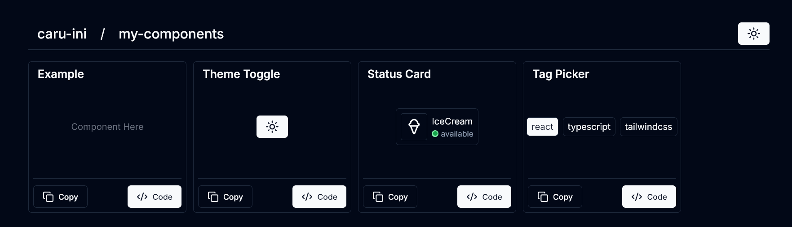

# My-Components

[日本語](/README_ja.md)

## Overview

A repository containing components I personally created.\
To use them, it is necessary to add the components from `shadcn/ui` beforehand.

## Screenshots



## Check it out here

<https://components.caru.live/>

## How to Add Your Own Components

1. Add the component to `components/collection`.
2. Add it as a child element of `Showcase` in `app/page.tsx`.

Here's an example:

```tsx
<Showcase title='Theme Toggle' code={getSnippet('toggletheme')}>
  <ToggleTheme />
</Showcase>
```

3. Launch a local server with `npm run dev`.
4. Extract the code of the component with `npm run extract`.
5. Press the `Code` button in `Showcase` to confirm that the component code is displayed correctly.

## Credits

- [shadcn/ui](https://github.com/shadcn-ui/ui)

## License

[MIT](/LICENSE)
